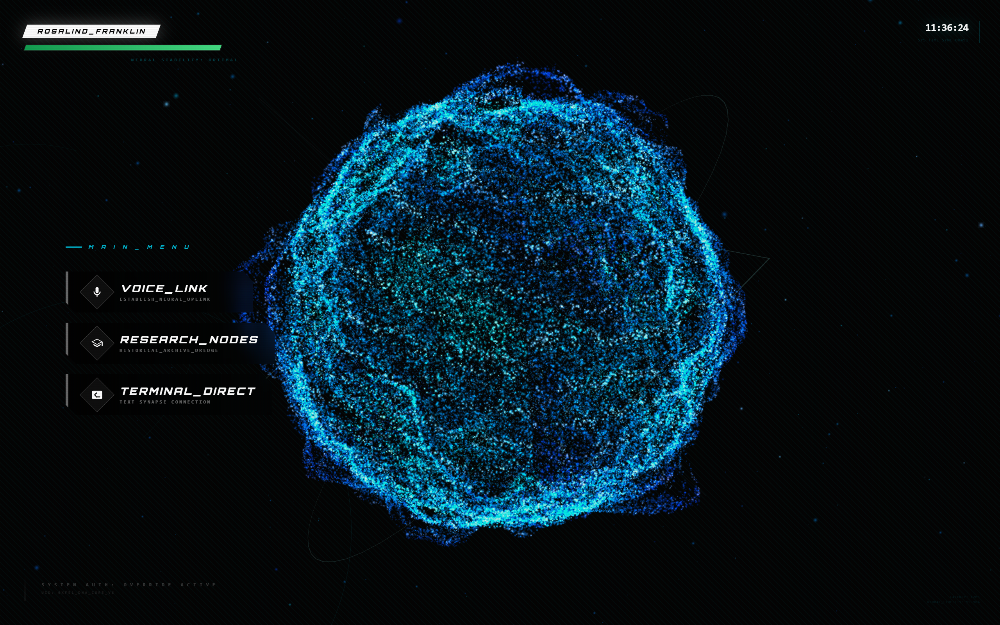

# Rosalind Franklin Revival 🧬



A cutting-edge neural interface platform developed as a school project. Featuring advanced voice interaction, research archive access, and real-time AI-powered insights celebrating scientific innovation.

## 🚀 Live Project

Access the live project here: **https://rosalind-franklin-revival-1015943995500.us-west1.run.app/**

## 👨‍💻 Developer

**Gurnoor Tamber** - Check out my portfolio and more work: **https://praknoor.dev**

## Features

- Voice Link Neural Interface
- Research Archive Node Access
- Terminal Direct Connection
- Real-time HUD Overlay
- Cinematic Intro Experience

## 🛠️ Tech Stack

```
┌─────────────────────────────────────────┐
│            TECH ARCHITECTURE            │
├─────────────────────────────────────────┤
│  Frontend: React + TypeScript           │
│  Build Tool: Vite                       │
│  Styling: Tailwind CSS                  │
│  AI Integration: Google GenAI           │
│  Voice: Web Speech API                  │
│  Visuals: Three.js (Particle System)    │
└─────────────────────────────────────────┘
```

## 🚀 Quick Start

### Prerequisites

- Node.js (v16 or higher)
- npm or yarn package manager
- Google AI API key

### Installation Steps

```bash
# Clone the repository
git clone https://github.com/GurnoorLog/rosalind_franklin_revival.git

# Navigate to project directory
cd rosalind_franklin_revival

# Install dependencies
npm install

# Set up environment variables
echo "API_KEY=your_google_ai_api_key_here" > .env

# Start the development server
npm run dev
```